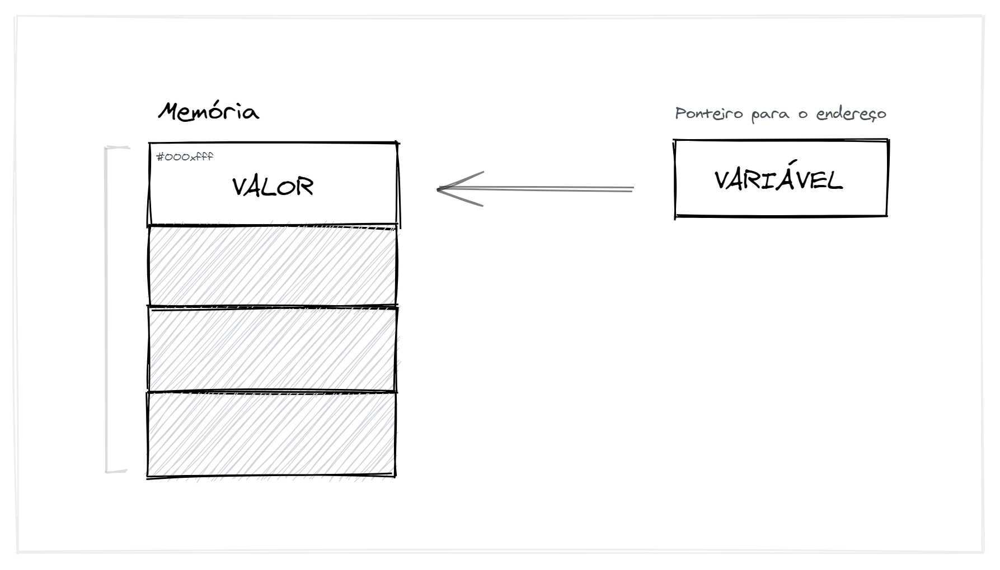
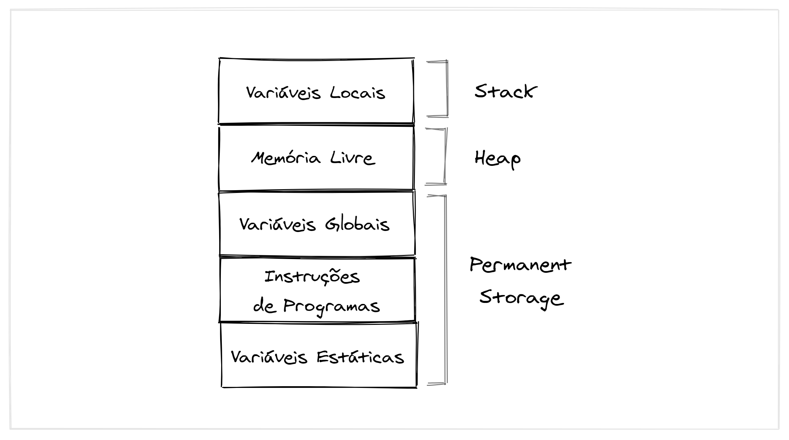
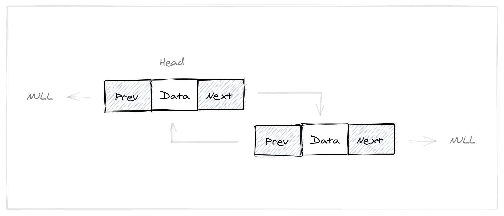
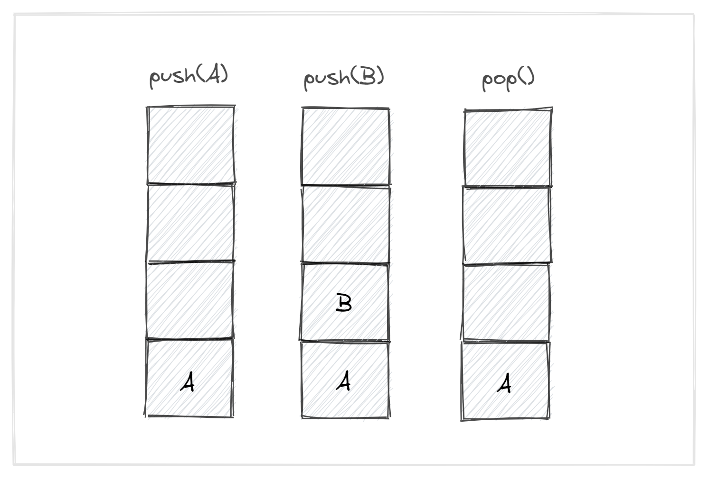

# Memória, Listas e Pilhas<br>
Falaremos nesse artigo sobre três assuntos que são pertinentes e fundamentais para o entendimento básico de estrutura de dados.

## Memória<br>
Ao utilizarmos uma linguagem de programação, todo tipo de declaração - seja de uma váriavel ou de uma constante - é feita utilizando um pedaço de memória para tal.<br><br>
Ao declararmos um valor durante um pedaço de código, utilizamos uma váriavel ou constante. O que acontece nesse ponto é que o valor não é armazenado no que acabamos de declarar e sim em um pedaço da memória do sistema. A váriavel ou constante que declaramos armazena o endereço direto para esse pedaço na memória, portanto acabamos por ter uma falsa representação do que possuimos armazenado.


*Ilustração exemplificando como o armazenamento acontece por debaixo dos panos.*

Podemos separar os espaços de uma memória em três blocos distintos: Stack, Heap e Permanent Storage.<br>
Variáveis globais, estáticas e instruções de programas obtêm sua memória na área de Permanent Storage, enquanto as variáveis locais são armazenadas em uma área de memória chamada Stack.<br><br>
Agora, o espaço de memória entre essas duas regiões é conhecido como Heap. Essa região é usada para alocação dinâmica de memória durante a execução do programa. O tamanho da Stack continua mudando.


*Ilustração exemplificando as áreas existentes na memória.*

Dentro da linguagem C possuimos três tipos de alocação de memória. São elas: Alocação Estática de Memória, Alocação Automática de Memória e Alocação Dinâmica de Memória.

### Alocação Estática de Memória<br>
A alocação estática acontece quando você declara uma variável estática ou global. O espaço é alocado uma vez, quando o programa é iniciado e permanece reservado até o final do programa. Essas variáveis ​​são armazenadas em um segmento de dados (uma área de tamanho fixo na memória reservada para essas variáveis).

### Alocação Automática de Memória<br>
A alocação automática acontece quando você declara uma variável automática, como um argumento de função ou uma variável local. O espaço para uma variável automática é alocado quando a instrução composta que contém a declaração é inserida e é liberada quando a instrução composta é encerrada. Essas variáveis são armazenadas em uma pilha .

### Alocação Dinâmica de Memória<br>
A memória é alocada dinamicamente para as entidades do programa. O programador tem liberdade para alocar e liberar a memória para as entidades do programa. Essa área de memória é conhecida como Heap. O Heap é outra área que começa pequena e cresce, mas cresce apenas quando há uma chamada explícita para algumas funções de alocação de memória, como `malloc`, `calloc` ou `realloc`.

```c
ponteiro = (float*) malloc(100 * sizeof(float));
```

## Listas

Uma Lista, ou também conhecida como Lista Encadeada, é uma estrutura de dados linear, na qual os elementos não são armazenados em locais de memória contíguos. Os elementos em uma lista vinculada são vinculados usando ponteiros, como mostrado na imagem abaixo:


*Ilustração exemplificando como funciona uma lista encadeada.*

De forma mais simples, podemos definir uma lista como um conjunto de nós, onde cada nó armazena seus dados e também um ponteiro indicando para o próximo nó. Normalmente utilizamos esse tipo de estrutura quando não sabemos exatamente o tamanho final de nossa lista.<br><br>
Além da Lista Encadeada, para podermos aumentar um pouco a complexidade desse tipo de estrutura, também possuimos as Listas Duplamente Encadeada. Nesse tipo de estrutura, além de possuirmos um ponteiro indicando o endereço do próximo nó em nossa lista, também possuimos um ponteiro indicando o endereço do nó anterior em cada nó da lista. Abaixo possuimos um melhor exemplo:


*Ilustração exemplificando como funciona uma lista duplamente encadeada.*

Esse tipo de lista nos permite ao invés de sempre inserir um nó no inicio, inserir tanto no final quanto no inicio, além também de nos permitir listar os nós em diferentes direções.<br><br>
Abaixo podemos observar a implementação de uma Struct em C exemplificando uma Lista Duplamente Encadeada:

```c
// Nó de uma Lista Duplamente Encadeada
struct Node {
 int data;
 struct Node* next; // Ponteiro para o próximo nó da lista
 struct Node* prev; // Ponteiro para o nó anterior da lista
};
```

## Pilhas

Uma pilha pode ser definida como um conjunto de elementos onde o acesso a eles só pode ser feito através de seu topo. Ou seja, para acessarmos um determinado elemento, devemos retirar todos os outros que sobrepõe o elemento desejado até encontrarmos.<br>
Possuimos duas operações que devem ser definidas em uma pilha: a operação que adiciona um novo elemento ao topo e operação que remove o elemento do topo. Essas duas operações podem ser chamadas de `push()` e `pop()`.<br><br>
Temos uma ilustração que melhor exemplifica uma Pilha:


*Ilustração exemplificando como funciona uma pilha.*

A implementação de Lista acaba sendo muito simples, uma vez que sua complexidade acaba sendo mais baixa do que em outros tipos de Estrutura de Dados. Podemos implementar uma lista de duas formas: através de vetor e através de uma Lista Duplamente Encadeada (estrutura vista anteriormente).<br><br>
Abaixo podemos observar a implementação de uma Pilha em C:

```c
#define MAX 50

// Struct que define o formato da Pilha
struct Pilha {
 int length; // Tamanho total de elementos na pilha
 float vet[MAX]; // Vetor contendo todos os elementos
};

Pilha * createStack(void) {
 Pilha * stackPointer = (Pilha *) malloc(sizeof(Pilha));
 stackPointer->length= 0; // Inicializa com zero elementos

 return stackPointer;
}

int emptyStack(Pilha * stackPointer) {
 return (stackPointer->length == 0);
}

void freeStack(Pilha * stackPointer) {
 free(stackPointer);
}

void pushElement(Pilha * stackPointer, float value) {
 if (stackPointer->length == MAX) { // Capacidade esgotada
  printf("Capacidade da pilha estourou.\n");
  exit(1);
 }

 // Utiliza o elemento atual do topo para inserir o novo elemento
 stackPointer->vet[stackPointer->length] = value;
 stackPointer->length++;
}

float popElement(Pilha * stackPointer) {
 float value;

 if (emptyStack(stackPointer)) { // Stack vazia
  printf("Pilha vazia.\n");
  exit(1);
 }

 // Remove o elemento do topo
 value = stackPointer->vet[stackPointer->lenth-1];
 stackPointer->length--;

 return value;
}
```
